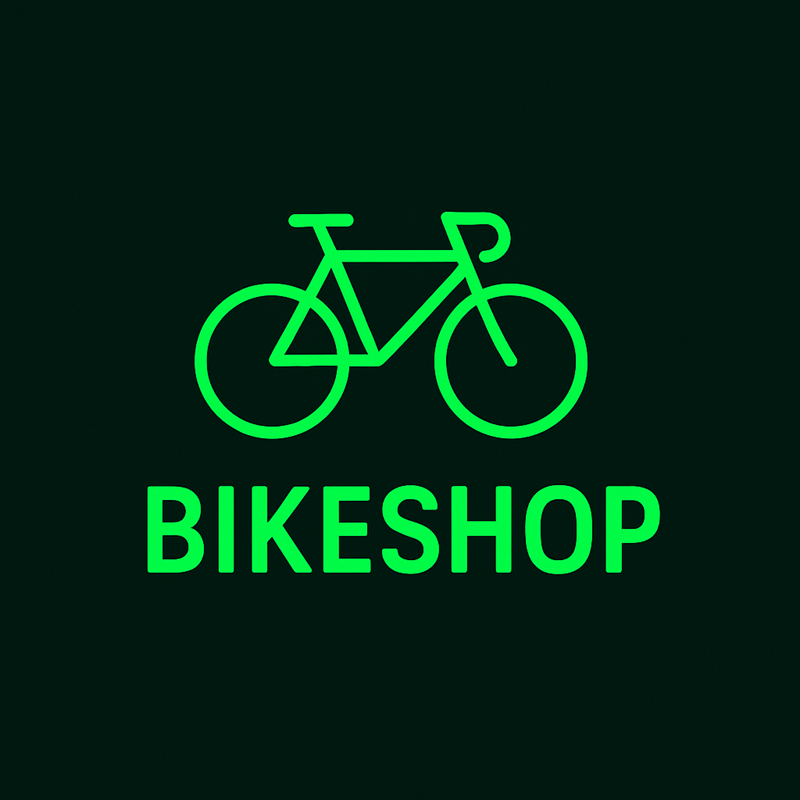

<p align="center">

</p>
<h2>Proyecto</h2> 
<p>El proyecto es una App movil y web para tienda de bicicletas, teniendo totalmente dentro del rol de "Administrador" la administración de la gestión del inventario,
Plantilla de clientes y todos los pedidos realizados por los clientes.
En el rol de "Usuario" o "invitado" podra ver el catalogo de bicicletas disponibles , novedades sobre los productos,  ver la información del producto y la compra
de la misma.</p>

## Usar la App 🚀

Actualmente la aplicación se encuentra en construcción . Para poder manejar la aplicación y probarla 


### Activar la App 📋

Para activar y poder usar la app.
Primero tenemos que descargar el repositorio completo en [ Code ] Descargar .Zip

Despues de haber descargado el repositorio lo añadimos, dentro del terminar del IDE nos vamos a la carpeta de backend e iniciamos Node.js

Accedemos a la carpeta:
```
cd backend
```
Iniciamos Node.js
```
node index.js
```

Despues de haber iniciado node.js, abrimos otro terminar dentro del mismo IDE y nos vamos a la carpeta de frontend para iniciar ionic

Accedemos a la carpeta:
```
cd frontend
```
Iniciamos ionic:

```
ionic serve
```

Una vez iniciada se abrira el nuestro navegador favorito y le daremos a los botones [ ctrl + shift + i ] y lo pondremos con la vista movil

### Uso de la App

Actualmente la App solo podemos acceder a una parte de ella dado que esta en local, una vez iniciada veremos la pantalla de inicio de sesión.


_Finaliza con un ejemplo de cómo obtener datos del sistema o como usarlos para una pequeña demo_

## Ejecutando las pruebas ⚙️

_Explica como ejecutar las pruebas automatizadas para este sistema_

### Analice las pruebas end-to-end 🔩

_Explica que verifican estas pruebas y por qué_

```
Da un ejemplo
```

### Y las pruebas de estilo de codificación ⌨️

_Explica que verifican estas pruebas y por qué_

```
Da un ejemplo
```

## Despliegue 📦

_Agrega notas adicionales sobre como hacer deploy_

## Construido con 🛠️

* [Ionic-Framework](https://ionicframework.com/) - El framework web usado
* [Postman](https://www.postman.com/) - Manejador de API
* Coleccion Postman=[https://documenter.getpostman.com/view/48544649/2sB3QGvC3a]
* [ROME](https://rometools.github.io/rome/) - Usado para generar RSS
